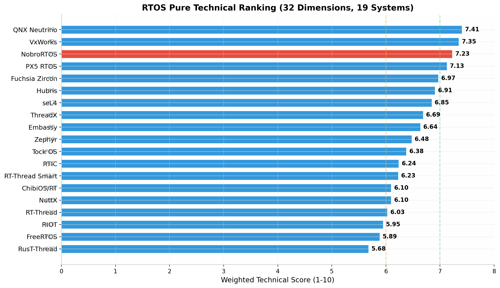
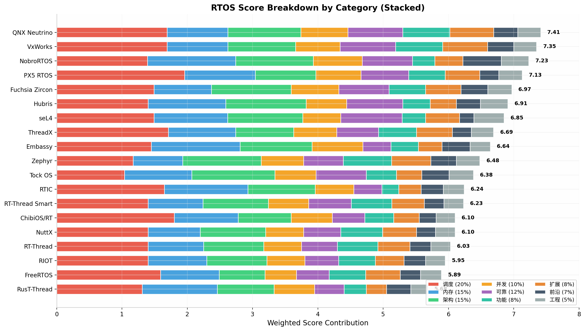
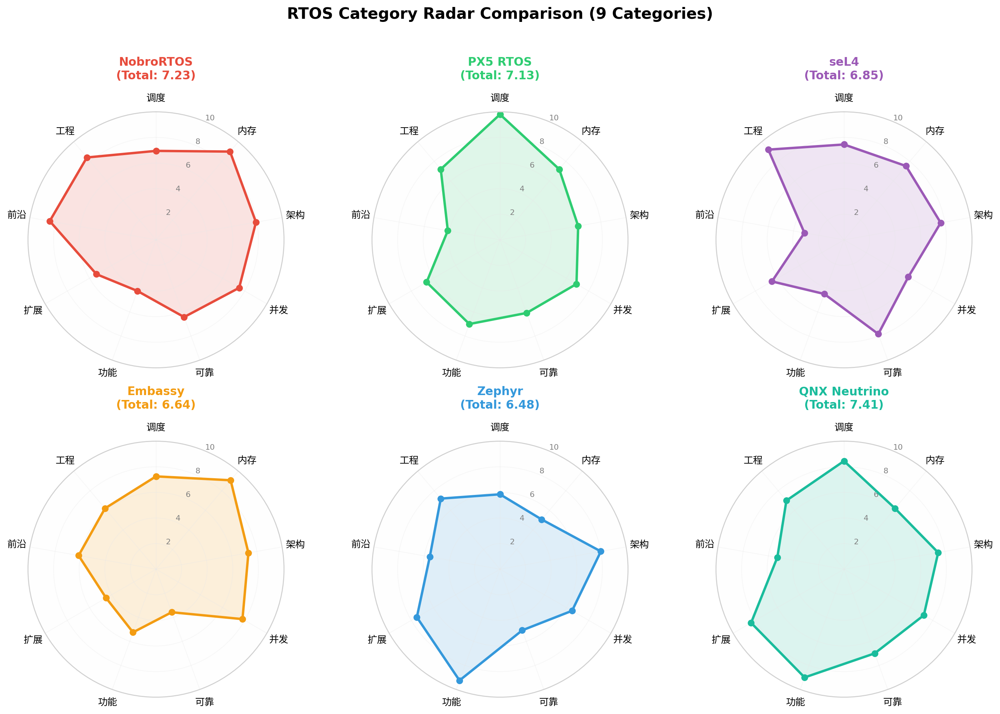
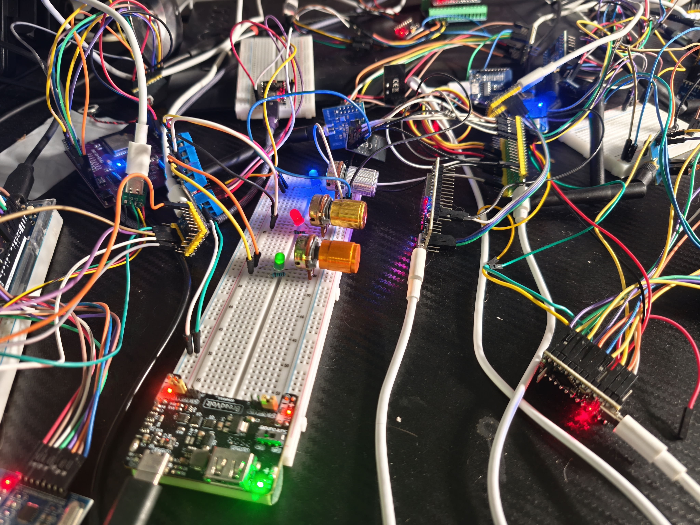

<p align="center"></p>

<h1 align="center">NobroRTOS Core</h1>

<p align="center"><strong>Un cœur minuscule. Un temps réel sérieux. Votre matériel.</strong></p>

<p align="center"><a href="README.md">English</a> · <a href="README.zh-CN.md">简体中文</a> · <a href="README.zh-TW.md">繁體中文</a> · <a href="README.ja.md">日本語</a> · <a href="README.ko.md">한국어</a> · <a href="README.es.md">Español</a> · <a href="README.pt-BR.md">Português</a> · <a href="README.fr.md">Français</a> · <a href="README.de.md">Deutsch</a> · <a href="README.it.md">Italiano</a> · <a href="README.ru.md">Русский</a> · <a href="README.ar.md">العربية</a> · <a href="README.hi.md">हिन्दी</a> · <a href="README.id.md">Bahasa Indonesia</a></p>

<p align="center">中文名：<strong>糯哥RTOS</strong> — 面向 AI、机器人、IoT 与智能控制的下一代超轻量嵌入式实时操作系统。</p>

NobroRTOS Core répond à la question essentielle d’un produit embarqué :
**quelle tâche s’exécute ensuite, et peut-elle finir à temps ?** Son runtime
léger sans tas vérifie les échéances avant le démarrage, tout en laissant à
l’application le contrôle des pilotes, interruptions, minuteries et modes basse consommation.

## Points forts

- **Ultra-léger :** la configuration MCS-51 mesurée débute à 504 octets de programme et 7 octets de données noyau.
- **Validation avant exécution :** surcharge, temporisation invalide, identités dupliquées et délais impossibles sont refusés.
- **Outils flexibles :** Arduino, PlatformIO, Rust `no_std` et génération C/assembleur via Python.
- **Comportement borné :** capacité fixe, priorités explicites et aucune pile de tâche cachée.

## Démarrage rapide

```text
python -m pip install nobro_rtos
nobro-core ports/byte/examples/useful/app.json --out generated
```

Consultez les guides [Arduino / PlatformIO](docs/ARDUINO_PLATFORMIO.md),
[Python](docs/PYTHON.md) et [Rust](docs/RUST.md).

## Une position technique solide

Dans le modèle fourni, couvrant 32 dimensions et 19 systèmes, NobroRTOS obtient
**7,23/10 et la troisième place**. Cette évaluation ciblée porte sur
l’architecture et les capacités ; elle ne généralise pas les benchmarks,
certifications ou la maturité commerciale.

<p align="center"></p>
<p align="center"></p>
<p align="center"></p>

## NobroRTOS avancé

Nous proposons également des cœurs avancés personnalisés pour les exigences de
temps, sécurité, connectivité, IA, robotique et matériel. Ils ont réussi un test
de charge simultané sur 18 cartes de développement physiques.

<p align="center"></p>

Rejoignez [Discord](https://discord.gg/NrRrQKmT2) et découvrez
[NiusRobotLab sur YouTube](https://www.youtube.com/@NiusRobotLab).

NobroRTOS Core est publié sous **GPL-3.0-only** ; [LICENSE](LICENSE) fait foi.
