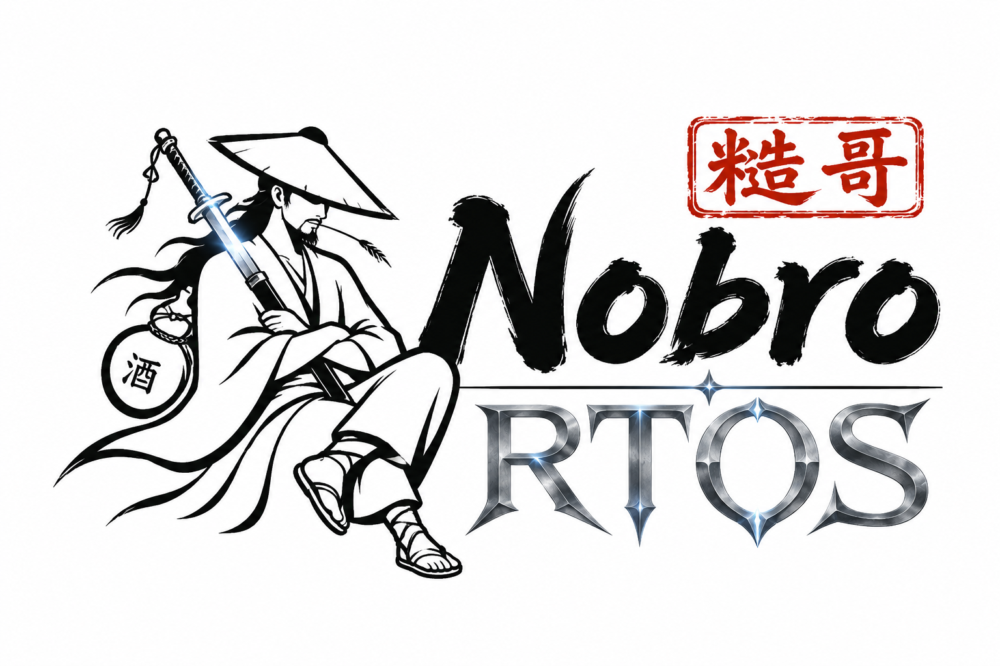
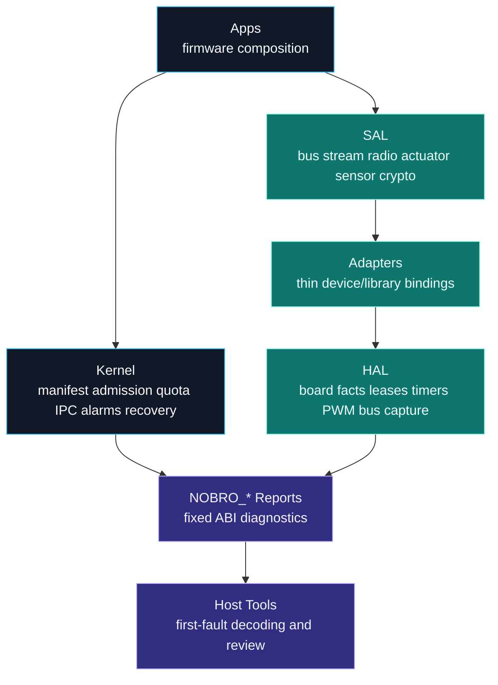
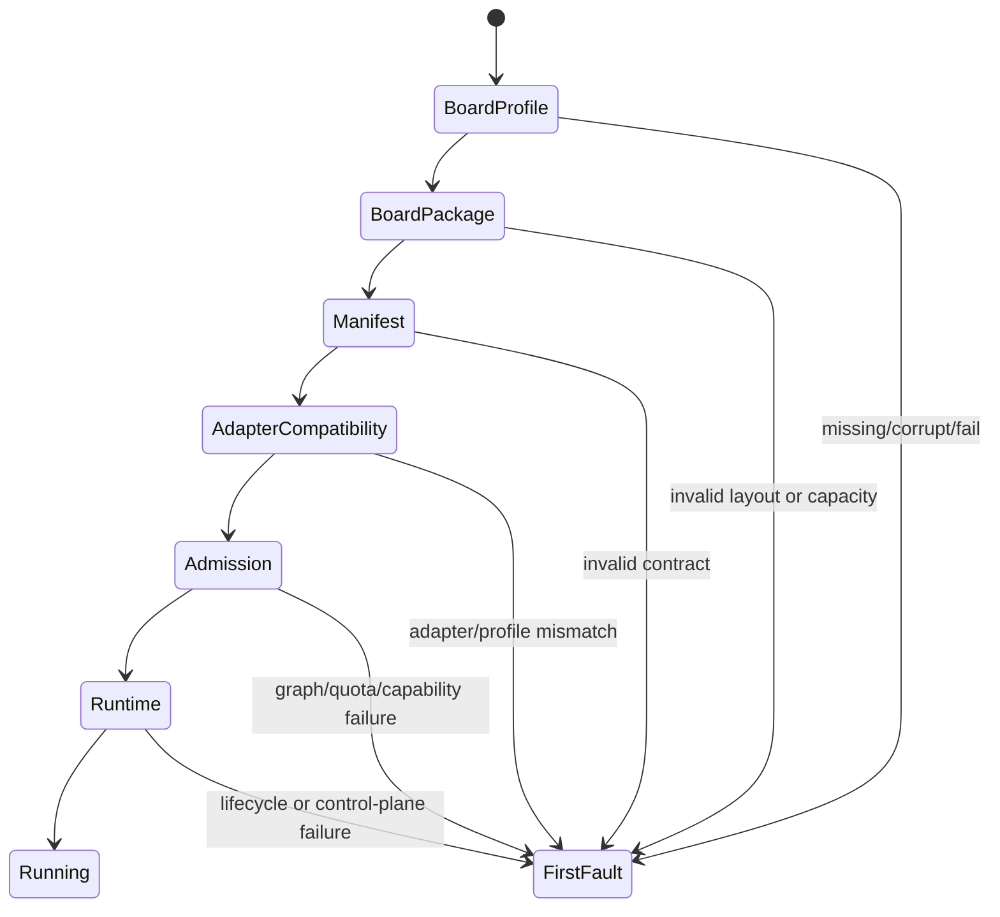
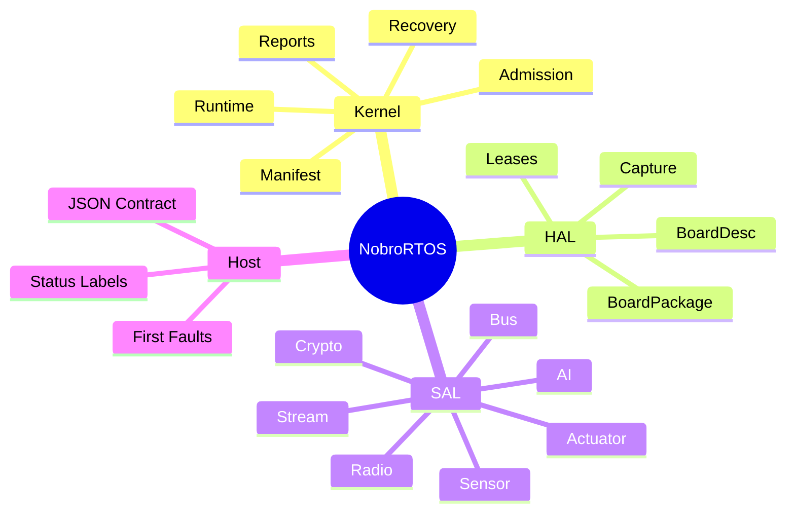

<p align="center">
  
</p>

<p align="center">
  <strong>A tiny, Rust-first real-time OS that makes one board &mdash; or a hundred &mdash; feel teachable.</strong><br>
  The <strong>AI &middot; Robot &middot; IoT nexus</strong> for microcontrollers: explicit contracts, static memory,
  deadline discipline, and host-readable diagnostics &mdash; with every support tier stated explicitly.
</p>

<p align="center">
  <strong>中文名：糙哥RTOS</strong> &mdash; 面向 AI 机器人、IoT 与智能控制的超轻量嵌入式实时操作系统。
  为什么叫“糙哥”？因为好用到没朋友！
</p>

<p align="center">
  <a href="https://github.com/dunknowcoding/NobroRTOS"></a>
  
  
  
  
</p>
<p align="center">
  
  
  
  
  <a href="docs/GETTING_STARTED.md"></a>
</p>

<p align="center">
  <code>no_std</code> &middot; <code>static capacity</code> &middot; <code>deadline-aware</code> &middot; <code>NOBRO_* reports</code> &middot; <code>AI + ROS bridges</code>
</p>

---

<p align="center">
  
</p>

## Signal

NobroRTOS is built for microcontrollers where a servo pulse, an I2C transaction,
a radio slot, and a recovery decision all have to coexist inside tight memory
and timing budgets. It is not a desktop OS in miniature. It is a small,
inspectable control plane for robotics nodes that need to grow from one board
to many boards without turning every driver into a private universe.

The project starts with nRF52840-class boards and a deliberately compact kernel
surface: manifests, quotas, capability grants, static sample pools, health
reports, recovery policy, bounded AI inference contracts, and a service
abstraction layer for hardware, communication, and edge intelligence.

**Repository:** https://github.com/dunknowcoding/NobroRTOS
**Author:** dunknowcoding (YouTube NiusRobotLab)
**License:** PolyForm Noncommercial 1.0.0 (noncommercial use; source-available)

## Start In 60 Seconds

The fastest portable start is the host gate. Hardware deployment additionally needs
a prepared image and a safe flash path for the selected board profile.

```powershell
git clone https://github.com/dunknowcoding/NobroRTOS && cd NobroRTOS
python tools/run_checks.py --quick
```

That checks public contracts, packages, tutorials, bindings, and documentation without
touching hardware. Use `python sdk/cli/nobro.py flash --help` for image deployment.

Prefer a packaged environment? Install the dependency-free Python host core
with `pip install nobro_rtos`, install **NobroRTOS** from Arduino Library
Manager, or add `dunknowcoding/NobroRTOS` to PlatformIO `lib_deps`. The
Arduino/PlatformIO source relationship and configuration boundary are described
in [Arduino and PlatformIO packages](docs/ARDUINO_PLATFORMIO.md).

Create and run a graph-declared application without hand-writing the expanded
manifest, startup, capability, quota, and executor inputs:

```bash
python sdk/cli/nobro.py project new rover
python sdk/cli/nobro.py project run _work/projects/rover
```

The project command prints the derived contract and marginal costs, compiles the
graph scaffold, simulates it, and decodes the resulting report. Flashing remains a
separate, explicit step so a generated host scaffold is never mistaken for a device image.

For production nRF firmware, the one-file path uses the same small declaration to emit
both the admission workload and a `no_std` firmware graph:

```text
app rover
board nrf52840-s140
control motor every 5ms
periodic imu every 10ms -> motor
service camera every 40ms
```

```bash
python sdk/cli/nobro.py firmware tutorials/rover-one-file/app.nobro --build
python sdk/cli/nobro.py project explain _work/projects/rover/workload.json
```

Python uses the same task/wire vocabulary for host tests and native-firmware
input:

```python
from nobro_rtos import HZ, NobroApp

app = (NobroApp("rover", board="nrf52840-nosd")
       .task("motor", HZ(200), role="control")
       .task("imu", HZ(100))
       .wire("imu", "motor", 8))
app.run(50_000)
app.write_json("app.json")
```

```bash
python sdk/cli/nobro.py firmware app.json --build
```

Python callbacks run only in the host simulator. The generated device image is
native Rust; NobroRTOS does not claim on-device Python. A wire in this authoring
slice carries graph/capacity metadata, not Python objects or payload bytes.
The shared role/default/name/capacity contract is published at
`sdk/app-authoring-contract.json`; `sensor`, `channel`, and `connect` remain
compatibility aliases, while new code uses `periodic`, `task`, and `wire`.

Generated project workloads also have one optional-feature switchboard:
`"features": {"capacity-report": true}`. `project explain` obtains its
target-scoped flash/RAM reserve, latency class, and evidence from
`sdk/feature-catalog.json`; users do not duplicate prices or generated defines.
Unavailable and unpriced combinations fail closed rather than appearing free.
The same canonical workload builds native firmware directly:

```bash
python sdk/cli/nobro.py firmware _work/projects/rover/workload.json \
  --out _work/firmware --build
```

For the recorded no-SoftDevice nano composition, the linked
`capacity-report` delta is 296 B flash, 4 B static RAM, and 4 B total RAM;
the catalog keeps tighter gated ceilings of 384/16/32 B. These are
composition-specific static measurements, not physical latency, power, or
cross-RTOS results. The S140 row stays unavailable until separately measured.

The board line is mandatory: it selects the SoftDevice or no-SoftDevice linker layout
instead of guessing. Role defaults infer an initial budget and memory estimate; review
`workload.json` before hardware use. This is a measured five-line authoring path, not a
claim that every application or generated binary is smaller than another RTOS.

## Who It's For

| You are a&hellip; | NobroRTOS gives you |
| --- | --- |
| **Beginner / maker** | A host-only quick gate, an Arduino-style `setup()/loop()` in C++, and one-command hardware grading on the configured deep-HAL profile |
| **Embedded engineer** | `no_std`, no heap, static capacity, deadline contracts, declared capability grants, and the `embedded-hal` driver ecosystem |
| **Robotics / AI builder** | Bounded on-device inference + ROS-style bridge contracts kept off the hard-realtime path |
| **Researcher** | A small, inspectable control plane (manifest &rarr; admission &rarr; runtime &rarr; recovery) behind a stable host ABI you can measure |
| **Porting from another RTOS** | A thin SAL + C ABI for reusing driver/algorithm code while task wiring and resource contracts are re-expressed &mdash; see [docs/PORTING.md](docs/PORTING.md) |

## System Map



## Author A Module In Your Language

Module *logic* &mdash; not just config &mdash; can be written in **Rust, C, or C++**
over one `extern "C"` C ABI. The kernel admits your module and drives `init` /
`poll`; your code reaches hardware only through bounded host services. All three are
verified on hardware reading the same IMU.

```cpp
// C++ (Arduino style) -- bindings/cpp/examples/arduino_imu.cpp
#include "nobro_app.hpp"
void setup() { const uint8_t wake[2] = {0x6B, 0x01}; nobro::I2c::write(0x68, wake, 2); }
void loop()  { /* read the IMU via nobro::I2c, then nobro::publish_imu(...) */ }
NOBRO_ARDUINO_MODULE()
```

```c
/* C -- bindings/c/examples/declarative_app.c */
#include "nobro_app.h"
static int32_t imu(void) { /* sample one IMU */ return 0; }
static int32_t control(void) { /* update control output */ return 0; }
static int32_t app(void) {
    int32_t result = nobro_task("imu", HZ(100), imu);
    if (result < 0) return result;
    result = nobro_task("control", HZ(50), control);
    if (result < 0) return result;
    result = nobro_wire("imu", "control", 8);
    if (result < 0) return result;
    return nobro_run();
}
NOBRO_APP(app)
```

Prefer pure config? A JSON contract generates a compiling Rust firmware. Prefer
existing synchronous drivers? The `embedded-hal` adapters preserve compatible device
logic while NobroRTOS supplies the bus; async-only drivers need an async adapter or a
bounded executor wrapper. The C wire declaration derives the graph relationship and
mailbox ownership; payload send/receive remains a separate API. Authoring details:
[bindings/c/README.md](bindings/c/README.md) and
[bindings/cpp/README.md](bindings/cpp/README.md).

## Why It Exists

Robotics firmware often grows in an uncomfortable direction: a board package
owns the pins, a driver owns timing, an app owns recovery, a host script owns
the truth, and every new board adds another private rule. NobroRTOS pushes
those rules into explicit contracts so the system remains teachable,
debuggable, and portable.

The design target is a friendly RTOS with strong engineering bones:

| Pillar | What NobroRTOS Does |
| --- | --- |
| Deadline discipline | Keeps deadline contracts visible in scheduling and module specs |
| Static memory | Uses fixed-capacity pools, reports, mailboxes, alarms, and ledgers |
| Compatibility | Treats board layout, capacity, pins, and boot profile as data |
| Modularity | Keeps apps, adapters, SAL, kernel, HAL, and host contracts separated |
| Diagnostics | Exports stable `NOBRO_*` symbols for first-fault host decoding |
| Recovery | Routes faults through health counters, event logs, and module-scoped actions |
| Edge AI | Treats local inference, sidecars, cloud APIs, and model metadata as bounded RTOS contracts |
| Robotics bridges | Keeps ROS-style topics, services, actions, and parameters outside hard-realtime hot paths |

## Boot Diagnostics

NobroRTOS boot visibility is designed as a chain. Host tooling should report
the first non-passing stage and stop guessing.



| Report Symbol | Purpose |
| --- | --- |
| `NOBRO_BOARD_PROFILE_REPORT` | Selected board identity, flash origin, budgets, and critical pins |
| `NOBRO_BOARD_PACKAGE_REPORT` | Boot layout, flash/RAM regions, capacity, pins, and package validation |
| `NOBRO_MANIFEST_REPORT` | Module graph, capability, budget, and validation summary |
| `NOBRO_ADAPTER_COMPAT_REPORT` | Adapter inventory and profile compatibility |
| `NOBRO_ADMISSION_REPORT` | Startup ordering, quota seeding, and grant construction result |
| `NOBRO_RUNTIME_REPORT` | Runtime state, mailbox pressure, alarm schedule, quota usage, and event pressure |

## Current Progress

The software control plane is the deepest-tested area. Local Rust tests cover
manifests, quota accounting, capability grants, runtime disable paths, mailbox
cleanup, alarm cleanup, watchdog cleanup, degraded-mode reports, board-package
validation, boot assembly, host-readable diagnostics, and Python simulators for
quota, degraded-mode, scheduler, event-log, recovery, sensor, actuator, combined
runtime-drill flows, and safely materialized plus validated contract-first project
templates with VS Code task metadata and Python board bridge onboarding.

That control plane runs on **real hardware** (nRF52840 + an IMU),
and module **logic can be authored in Rust, C, or C++** over one kernel and one
`extern "C"` C ABI - all three providers admitted by the kernel and reading a sensor
end to end on the development board (see [bindings/c/README.md](bindings/c/README.md)).
`usb_cdc_demo` exposes diagnostics over USB serial on boards that provide native USB.



Near-term engineering focus:

- reduce contract boilerplate for common periodic and event-driven apps without
  weakening admission or hiding resource cost
- make async composition a first-class bounded authoring option
- extend deep runtime/HAL evidence beyond the primary nRF52840 target
- keep security, persistence, recovery, and power behavior tied to executable gates

## Repository Layout

```text
NobroRTOS/
|-- core/
|   |-- crates/
|   |   |-- nobro_kernel/   # manifest, admission, runtime, recovery, reports
|   |   |-- nobro_hal/      # board data, leases, timers, PWM, bus, capture
|   |   |-- nobro_sal/      # portable service traits
|   |   `-- nobro_host/     # host report decoders and stable labels
|   |-- adapters/<domain>/  # thin implementations; large protocol domains may add one family level
|   |-- apps/<use-case>/    # reusable firmware compositions and examples
|   |-- boards/<platform>/  # data-only real-board profiles
|   `-- ports/              # flat MCU-family provider implementations
|-- sdk/                    # standalone SDK packaging surface
|-- packages/               # Arduino and PlatformIO package surfaces
|-- bindings/               # C, C++, and Python-facing wrappers
|-- tools/                  # package builders, validators, generators
|-- docs/                   # user, API, architecture, porting, operations
|-- host/                   # JSON mirror of the host contract
`-- LICENSE
```

The Rust crate package names use the `nobro-*` API prefix, while repository
folders use the `nobro_*` project prefix.

## Hardware Support Boundary

nRF52840 is the deep-HAL profile; other rows in the support matrix may implement only
selected providers or the portable core. Fixed `NOBRO_*` reports expose explicit
completion and checksum fields. Users can deploy a prepared image with `nobro flash`
and inspect serial reports where the application exposes them.

**No hardware on your desk?** The software side grades itself the same way:

```bash
python tools/run_checks.py    # bindings + contracts + packages -> "RESULT: ALL PASS"
```

### Hardware support, honestly tiered

"Supports N boards" hides more than it says, so NobroRTOS states exactly what each
target gets. The machine-readable capability matrix is `core/boards/platform_tiers.json`
(validated by `tools/check_platform_tiers.py`). Each native or Arduino composition
binds every capability to gates scoped to that exact platform, composition, and claim.
Hosted jobs execute the declared argv from a clean, session-bound receipt directory and
must return every required receipt. Each session is freshness-bound to the current Git
HEAD, tracked diff, and nonignored untracked source content; ignored `_work` output is
excluded. A target build is never treated as physical proof.
Cross-compile coverage is
`tools/check_portability.sh`; the extended build matrix (ports + boards + SDK) is
`tools/ci_matrix.sh`.

| Tier | What it means | Targets today |
| --- | --- | --- |
| **Deep HAL** | one native composition implements every currently declared provider capability | nRF52840 |
| **Provider ports** | one or more portable `nobro_hal` provider traits implemented for the target | RP2350 (Cortex-M33), ESP32-C3 (RISC-V), ESP32-S3 (Xtensa LX7), RA4M1/UNO R4 |
| **Core ports** | target startup and status path available; peripheral providers are incomplete | SAMD21 (+ an 8-bit AVR kernel-lite subset) |
| **Compile targets** | portable crates cross-compile cleanly; no runtime claim | 6 MCU families (Cortex-M0+/M3/M4F/M33, RISC-V imc/imac) |
| **Board profiles** | `board.json` data validated by tooling; a planning artifact, not a port | STM32F4, Teensy 4, and friends |

RA4M1's native row means timebase, deadline, USB, and an opt-in GPT/ELC/DMAC
completion future. UNO R4 and ArduinoNRF wrappers
for clock/deadline/ADC/PWM/I2C/SPI/byte I/O are separate board-core compositions and do
not inflate native tiers; generic Arduino PWM is not claimed as servo PWM. The
ArduinoNRF composition is compiled on its supported Windows toolchain with the exact
`usbcdc=enabled` board selection.

The exact scheduling, resource, isolation, tooling, and per-platform boundaries are
maintained in the public [limitations matrix](docs/LIMITATIONS.md).

## Capability Matrix

<details>
<summary><strong>Expand the full capability matrix</strong> &mdash; every subsystem, its status, and the receipts</summary>

| Area | Status | Notes |
| --- | --- | --- |
| Kernel manifest model | Present | Fixed-capacity module specs, criticality, capability bits, budgets |
| Startup planning | Present | Graph planner with cycle and capacity checks |
| Runtime control plane | Present | Mailbox, alarms, KV, quotas, watchdog, health, recovery |
| Boot assembly facade | Present | No-heap app startup helper preserving manifest/admission reports |
| Board package validation | Present | Boot layout, flash/RAM region, capacity, critical pins |
| Board package catalog | Present | Host-reviewable package list for current boot layouts |
| Host ABI contract | Present | JSON contract plus `nobro-host` layouts and status helpers |
| Adapter compatibility | Present | Descriptor sets, preflight, compatibility report |
| AI adapter contract | Present | Bounded inference request/result contract, route policy, and host-readable model reports |
| AI route policy | Present | Local, edge, remote, and hybrid inference routing with stale snapshot fallback |
| On-device inference | Present | Bounded `AiInferenceSal` motion classifier with explicit memory and timeout contracts |
| Multi-board expansion | In progress | Data-first board profiles in `core/boards/` mirror the HAL board catalog; portable crates cross-compile for Cortex-M and RISC-V families through `tools/check_portability.sh` |
| Host tooling UX | In progress | Host, report, boot, and distribution metadata checks are available |
| ROS bridge | Present | Bounded topic/service/action/parameter contracts plus a SAL bridge trait |
| SDK packaging | Validated | Standalone SDK, Arduino, and PlatformIO metadata contract-checked + manifest paths validated (`tools/check_sdk_manifest.py`) |
| Hardware bring-up | Present | nRF52840 IMU, scheduler, event capture, PWM, and USB-CDC paths are implemented |
| Module authoring (Rust / C / C++) | Present | Author module logic over the `extern "C"` C ABI (`nobro_app.h` / `.hpp`); the kernel admits and drives it |
| embedded-hal compatibility | Present | `embedded_hal::i2c::I2c` adapter - unmodified embedded-hal drivers run on NobroRTOS |
| Board connectivity adapters | In progress | Portable WiFi/BLE contracts are present; UNO R4 WiFiS3 has a compile-only, zero-disabled association facade while physical traffic and resource pricing remain gated |
| C/C++/Python interfaces | Present | Module authoring in C/C++/Rust; report/AI/ROS C & C++ views; Python builders, decoders, validators, board bridge |

</details>

## Quick Start

Install Rust and the embedded target:

```powershell
rustup target add thumbv7em-none-eabihf
```

Run host-side validation from the workspace:

```powershell
cd core
$env:CARGO_TARGET_DIR = (Resolve-Path '..\_work').Path + '\cargo-target'
cargo test -p nobro-kernel --target x86_64-pc-windows-msvc
cargo test -p nobro-sal --target x86_64-pc-windows-msvc
cargo test -p nobro-host --target x86_64-pc-windows-msvc
```

Check the embedded build graph:

```powershell
cd core
$env:CARGO_TARGET_DIR = (Resolve-Path '..\_work').Path + '\cargo-target'
cargo check --workspace
```

Use `_work/` for local build products, downloaded tools, logs, and scratch
artifacts. It is intentionally ignored by Git.

Validate public contracts and package metadata:

```powershell
python tools/nobro_contract_tool.py check-host-contract
python tools/nobro_contract_tool.py check-distribution-metadata
python tools/nobro_contract_tool.py check-public-headers
```

Board-facing examples are kept as reusable library and contract references.

## Documentation

| Guide | Use It For |
| --- | --- |
| [Documentation Index](docs/README.md) | Guided path from first run to internals |
| [User Manual](docs/USER_GUIDE.md) | Setup, app assembly, diagnostics, common workflows |
| [API Manual](docs/API.md) | Public crate contracts and examples |
| [System Architecture](docs/ARCHITECTURE.md) | Layering, memory discipline, recovery model |
| [Porting Guide](docs/PORTING.md) | Adding boards and preserving board/package contracts |
| [Host Contract](docs/API.md) | `NOBRO_*` ABI, checksum rules, stage order |
| [Operations Guide](docs/USER_GUIDE.md) | Maintenance habits and validation gates |

## Design Principles

NobroRTOS keeps hardware descriptions data-driven, async work statically bounded,
module boundaries explicit, and mixed-criticality scheduling reviewable without
turning common robotics firmware into a large configuration exercise.
