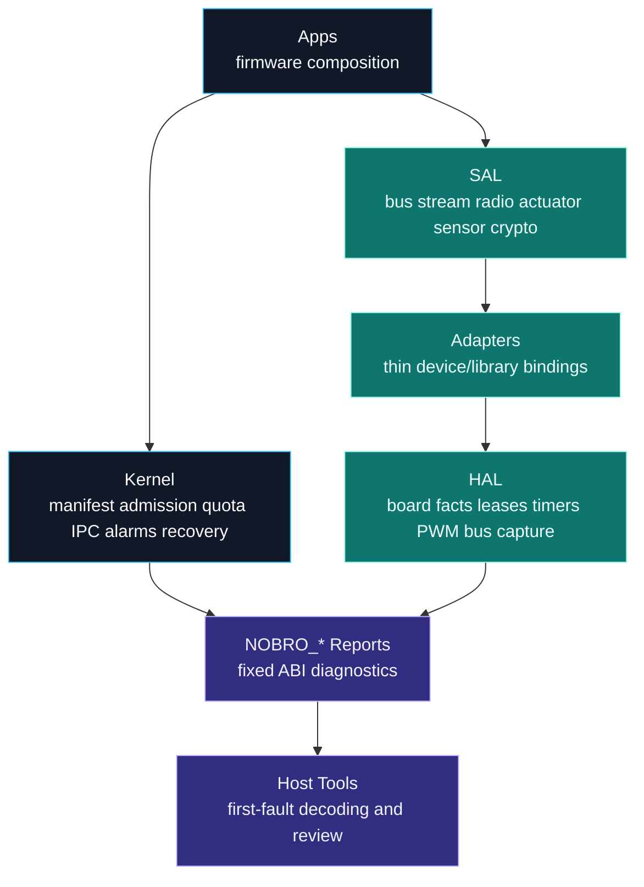
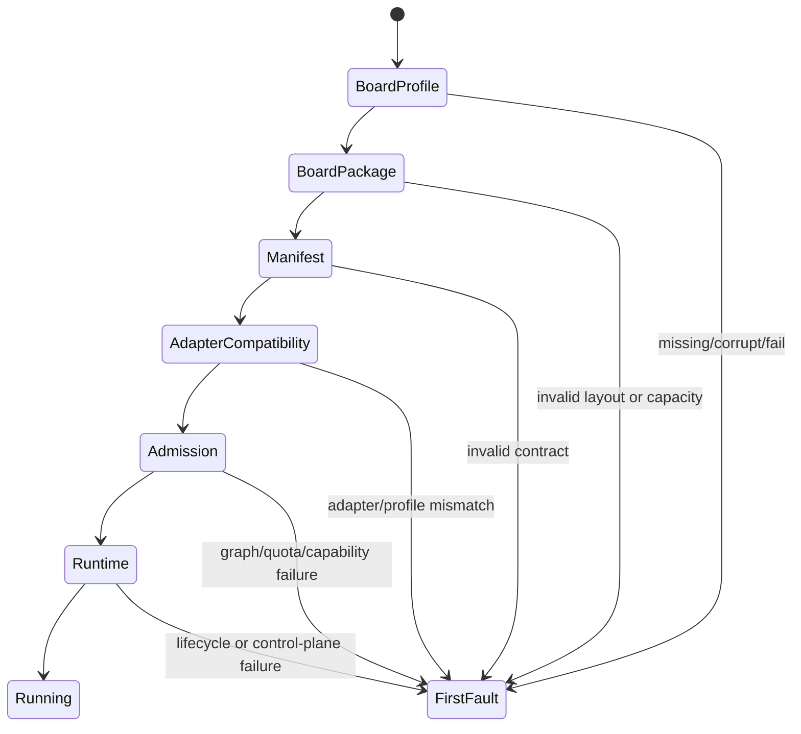
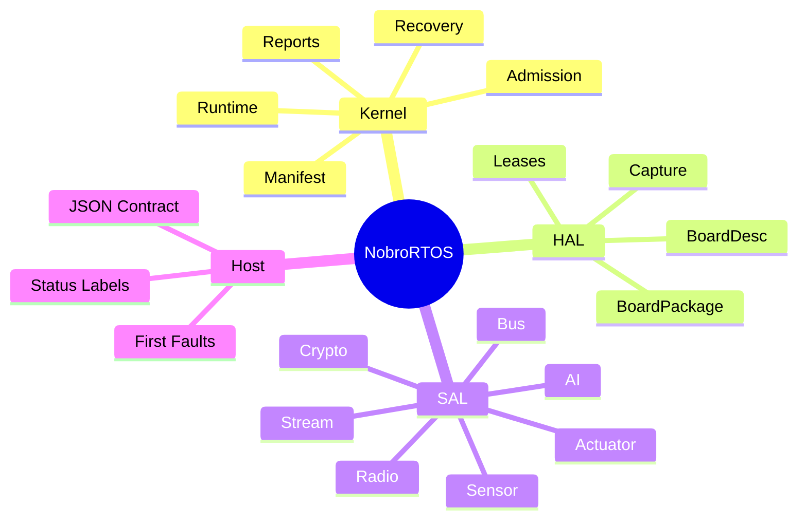

<p align="center">
  
</p>

<p align="center">
  <strong>A tiny, Rust-first real-time OS that makes one board &mdash; or a hundred &mdash; feel teachable.</strong><br>
  The <strong>AI &middot; Robot &middot; IoT nexus</strong> for microcontrollers: explicit contracts, static memory,
  deadline discipline, and host-readable diagnostics &mdash; with every support tier stated explicitly.
</p>

<p align="center">
  <strong>Chinese name: 糙哥RTOS</strong> &mdash; a lightweight embedded RTOS for AI, robotics, IoT, and intelligent control.
</p>

<p align="center">
  <a href="https://github.com/dunknowcoding/NobroRTOS"></a>
  
  
  
  
</p>
<p align="center">
  
  
  
  
  <a href="docs/GETTING_STARTED.md"></a>
</p>

<p align="center">
  <code>no_std</code> &middot; <code>static capacity</code> &middot; <code>deadline-aware</code> &middot; <code>NOBRO_* reports</code> &middot; <code>AI + ROS bridges</code>
</p>

---

<p align="center">
  
</p>

## Signal

NobroRTOS is built for microcontrollers where a servo pulse, an I2C transaction,
a radio slot, and a recovery decision all have to coexist inside tight memory
and timing budgets. It is not a desktop OS in miniature. It is a small,
inspectable control plane for robotics nodes that need to grow from one board
to many boards without turning every driver into a private universe.

The project starts with nRF52840-class boards and a deliberately compact kernel
surface: manifests, quotas, capability grants, static sample pools, health
reports, recovery policy, bounded AI inference contracts, and a service
abstraction layer for hardware, communication, and edge intelligence.

**Repository:** https://github.com/dunknowcoding/NobroRTOS
**Author:** dunknowcoding (YouTube NiusRobotLab)
**License:** Apache-2.0

## Start In 60 Seconds

The fastest portable start is the host gate. Hardware evaluation additionally needs
a locally configured target profile and a safe flash/readback path.

```powershell
git clone https://github.com/dunknowcoding/NobroRTOS && cd NobroRTOS
python tools/run_checks.py --quick --no-evidence
```

That checks public contracts, packages, tutorials, bindings, and documentation without
touching hardware. For a configured nRF deep-HAL target, `python tools/nobro_hw_eval.py
imu` performs build, flash, report readback, and grading; it is not a generic command for
every advertised compile target.

Create and run a graph-declared application without hand-writing the expanded
manifest, startup, capability, quota, and executor inputs:

```bash
python sdk/cli/nobro.py project new rover
python sdk/cli/nobro.py project run _work/projects/rover
```

The project command prints the derived contract and marginal costs, compiles the
graph scaffold, simulates it, and decodes the resulting report. It can also import
and line-attribute Embassy or FreeRTOS task graphs; hardware mode delegates to the
state-restoring HIL evaluator and is explicit about which repository app it flashes.

For production nRF firmware, the one-file path uses the same small declaration to emit
both the admission workload and a `no_std` firmware graph:

```text
app rover
board nrf52840-s140
control motor every 5ms
sensor imu every 10ms -> motor
service camera every 40ms
```

```bash
python sdk/cli/nobro.py firmware tutorials/rover-one-file/app.nobro --build
python sdk/cli/nobro.py project explain _work/projects/rover/workload.json
```

The board line is mandatory: it selects the SoftDevice or no-SoftDevice linker layout
instead of guessing. Role defaults infer an initial budget and memory estimate; review
`workload.json` before hardware use. This is a measured five-line authoring path, not a
claim that every application or generated binary is smaller than another RTOS.

## Who It's For

| You are a&hellip; | NobroRTOS gives you |
| --- | --- |
| **Beginner / maker** | A host-only quick gate, an Arduino-style `setup()/loop()` in C++, and one-command hardware grading on the configured deep-HAL profile |
| **Embedded engineer** | `no_std`, no heap, static capacity, deadline contracts, declared capability grants, and the `embedded-hal` driver ecosystem |
| **Robotics / AI builder** | Bounded on-device inference + ROS-style bridge contracts kept off the hard-realtime path |
| **Researcher** | A small, inspectable control plane (manifest &rarr; admission &rarr; runtime &rarr; recovery) behind a stable host ABI you can measure |
| **Porting from another RTOS** | A thin SAL + C ABI for reusing driver/algorithm code while task wiring and resource contracts are re-expressed &mdash; see [docs/PORTING.md](docs/PORTING.md) |

## System Map



## Author A Module In Your Language

Module *logic* &mdash; not just config &mdash; can be written in **Rust, C, or C++**
over one `extern "C"` C ABI. The kernel admits your module and drives `init` /
`poll`; your code reaches hardware only through bounded host services. All three are
verified on hardware reading the same IMU.

```cpp
// C++ (Arduino style) -- bindings/cpp/examples/arduino_imu.cpp
#include "nobro_app.hpp"
void setup() { const uint8_t wake[2] = {0x6B, 0x01}; nobro::I2c::write(0x68, wake, 2); }
void loop()  { /* read the IMU via nobro::I2c, then nobro::publish_imu(...) */ }
NOBRO_ARDUINO_MODULE()
```

```c
/* C -- bindings/c/examples/imu_module.c */
#include "nobro_app.h"
int32_t nobro_app_init(void) { uint8_t w[2] = {0x6B, 0x01}; return nobro_i2c_write(0x68, w, 2); }
int32_t nobro_app_poll(void) { /* nobro_i2c_write_read(...) + nobro_publish_imu(...) */ return 0; }
```

Prefer pure config? A JSON contract generates a compiling Rust firmware. Prefer
existing synchronous drivers? The `embedded-hal` adapters preserve compatible device
logic while NobroRTOS supplies the bus; async-only drivers need an async adapter or a
bounded executor wrapper. Authoring details: [bindings/c/README.md](bindings/c/README.md) and
[bindings/cpp/README.md](bindings/cpp/README.md).

## Why It Exists

Robotics firmware often grows in an uncomfortable direction: a board package
owns the pins, a driver owns timing, an app owns recovery, a host script owns
the truth, and every new board adds another private rule. NobroRTOS pushes
those rules into explicit contracts so the system remains teachable,
debuggable, and portable.

The design target is a friendly RTOS with strong engineering bones:

| Pillar | What NobroRTOS Does |
| --- | --- |
| Deadline discipline | Keeps deadline contracts visible in scheduling and module specs |
| Static memory | Uses fixed-capacity pools, reports, mailboxes, alarms, and ledgers |
| Compatibility | Treats board layout, capacity, pins, and boot profile as data |
| Modularity | Keeps apps, adapters, SAL, kernel, HAL, and host contracts separated |
| Diagnostics | Exports stable `NOBRO_*` symbols for first-fault host decoding |
| Recovery | Routes faults through health counters, event logs, and module-scoped actions |
| Edge AI | Treats local inference, sidecars, cloud APIs, and model metadata as bounded RTOS contracts |
| Robotics bridges | Keeps ROS-style topics, services, actions, and parameters outside hard-realtime hot paths |

## Boot Diagnostics

NobroRTOS boot visibility is designed as a chain. Host tooling should report
the first non-passing stage and stop guessing.



| Report Symbol | Purpose |
| --- | --- |
| `NOBRO_BOARD_PROFILE_REPORT` | Selected board identity, flash origin, budgets, and critical pins |
| `NOBRO_BOARD_PACKAGE_REPORT` | Boot layout, flash/RAM regions, capacity, pins, and package validation |
| `NOBRO_MANIFEST_REPORT` | Module graph, capability, budget, and validation summary |
| `NOBRO_ADAPTER_COMPAT_REPORT` | Adapter inventory and profile compatibility |
| `NOBRO_ADMISSION_REPORT` | Startup ordering, quota seeding, and grant construction result |
| `NOBRO_RUNTIME_REPORT` | Runtime state, mailbox pressure, alarm schedule, quota usage, and event pressure |

## Current Progress

The software control plane is the deepest-tested area. Local Rust tests cover
manifests, quota accounting, capability grants, runtime disable paths, mailbox
cleanup, alarm cleanup, watchdog cleanup, degraded-mode reports, board-package
validation, boot assembly, host-readable diagnostics, and Python simulators for
quota, degraded-mode, scheduler, event-log, recovery, sensor, actuator, combined
runtime-drill flows, and safely materialized plus validated contract-first project
templates with VS Code task metadata and Python board bridge onboarding.

That control plane is now **verified on real hardware** (nRF52840 + an IMU),
and module **logic can be authored in Rust, C, or C++** over one kernel and one
`extern "C"` C ABI - all three providers admitted by the kernel and reading a sensor
end to end on the development board (see [bindings/c/README.md](bindings/c/README.md)). On-hardware results: the deadline
scheduler holds **2 us jitter / 0 misses**, the EGU->PPI->CAPTURE path **1 us
latency**, and `usb_cdc_demo` streams diagnostics over USB serial so probe-less
boards self-verify by opening a COM port.



Near-term engineering focus:

- reduce contract boilerplate for common periodic and event-driven apps without
  weakening admission or hiding resource cost
- make async composition a first-class bounded authoring option
- extend deep runtime/HAL evidence beyond the primary nRF52840 target
- keep security, persistence, recovery, and power behavior tied to executable gates

## Repository Layout

```text
NobroRTOS/
|-- core/
|   |-- crates/
|   |   |-- nobro_kernel/   # manifest, admission, runtime, recovery, reports
|   |   |-- nobro_hal/      # board data, leases, timers, PWM, bus, capture
|   |   |-- nobro_sal/      # portable service traits
|   |   `-- nobro_host/     # host report decoders and stable labels
|   |-- adapters/           # thin SAL implementations
|   |-- apps/               # firmware compositions and evaluation apps
|   `-- boards/             # board-facing notes and layout policy
|-- sdk/                    # standalone SDK packaging surface
|-- packages/               # Arduino and PlatformIO package surfaces
|-- bindings/               # C, C++, and Python-facing wrappers
|-- tools/                  # package builders, validators, generators
|-- docs/                   # user, API, architecture, porting, operations
|-- host/                   # JSON mirror of the host contract
`-- LICENSE
```

The Rust crate package names use the `nobro-*` API prefix, while repository
folders use the `nobro_*` project prefix.

## Verified On Hardware

The rows below are snapshots from the nRF52840 deep-HAL profile, checked through fixed
`NOBRO_*` reports. They do not imply the same runtime depth on compile-only targets.

| Area | On-board result | Verify with |
| --- | --- | --- |
| **Real-time scheduler** | 2 us deadline jitter, 0 misses; EGU to PPI to CAPTURE 1 us latency; 50 Hz PWM | `nobro_hw_eval.py sched` |
| **Kernel-op latency** | measured max over 1000 runs: mailbox IPC 125 ns, capability check 219 ns, lease pair 2.0 us, longest interrupt-masked window 2.4 us ([table](docs/ENGINEERING.md)) | `nobro_hw_eval.py wcet` |
| **Kernel control plane** | 13 subsystems: quota, event log, mailbox, KV, alarms, watchdog, degrade, admission, capability, retry, lifecycle, health, and sample pool all pass | `kernel_selftest` report |
| **SAL admission** | AI route policy (local/edge/remote/hybrid + stale-snapshot fallback) and AI invocation preflight all pass | `nobro_hw_eval.py sal` |
| **Recovery** | watchdog expiry to Degraded/Notify; repeated errors to Recovering/RebootModule | `recovery_demo` report |
| **Edge AI** | bounded `AiInferenceSal` motion model: IDLE at 99.6% in its 2 ms budget; live over USB-CDC | `ai_imu_demo` report |
| **ROS bridge** | bounded topic bridge: 2148 messages published and transmitted, 0 dropped, peak depth 1/8 | `ros_imu_demo` report |
| **Robot closed loop** | IMU to servo pulse to PWM to readback, 1373/1373 readbacks exact | `closed_loop_demo` report |
| **Sensors** | MPU-9250 over the TWIM HAL (accel+temp+gyro in one burst), including 9-pulse stuck-bus recovery | `nobro_hw_eval.py imu` |
| **Module authoring** | the same module admitted + run in **Rust, C, and C++** over one `extern "C"` ABI | `c_abi_demo` report |
| **Driver ecosystem** | unmodified `embedded-hal` I2C drivers run via the adapter | `nobro_hw_eval.py eh` |
| **Diagnostics** | `usb_cdc_demo` streams reports over USB serial so probe-less boards self-verify on a COM port; verified on an nRF52840 development board and a clone-silicon nRF52840 board with a patched `nrf-usbd` plus a self-DFU watchdog | any serial monitor |

The `nobro_hw_eval.py` rows are fully automated (build → flash → run → read → grade,
see [docs/GETTING_STARTED.md](docs/GETTING_STARTED.md)); the `*_demo` rows flash the named
app and read its fixed `NOBRO_*` report over J-Link or USB serial.

**No hardware on your desk?** The software side grades itself the same way:

```bash
python tools/run_checks.py    # bindings + contracts + packages + chaos -> "RESULT: ALL PASS"
```

### Hardware support, honestly tiered

"Supports N boards" hides more than it says, so NobroRTOS states exactly what each
target gets. The machine-readable capability matrix is `core/boards/platform_tiers.json`
(validated by `tools/check_platform_tiers.py`); cross-compile coverage is
`tools/check_portability.sh`; the extended build matrix (ports + boards + SDK) is
`tools/ci_matrix.sh`.

| Tier | What it means | Targets today |
| --- | --- | --- |
| **Deep HAL** | leased peripherals, drivers, and every claim in the table above verified on the board with automated HIL | nRF52840 |
| **Provider ports** | implement the *same* portable `nobro_hal` provider traits as the deep HAL (starting with the microsecond timebase), compile-verified against the real target; firmware includes the provider check in its report and passed local physical smoke, while deeper peripheral parity and reusable automated HIL remain pending | RP2350 (Cortex-M33), ESP32-C3 (RISC-V) |
| **Conformance ports** | the portable core's shared self-test suite runs on the silicon and reports `all_pass` | ESP32-S3, RA4M1, SAMD21 (+ an 8-bit AVR kernel-lite subset) |
| **Compile targets** | portable crates cross-compile cleanly; no runtime claim | 6 MCU families (Cortex-M0+/M3/M4F/M33, RISC-V imc/imac) |
| **Board profiles** | `board.json` data validated by tooling; a planning artifact, not a port | STM32F4, Teensy 4, and friends |

The exact scheduling, resource, isolation, tooling, and per-platform boundaries are
maintained in the public [limitations matrix](docs/LIMITATIONS.md).

## Capability Matrix

<details>
<summary><strong>Expand the full capability matrix</strong> &mdash; every subsystem, its status, and the receipts</summary>

| Area | Status | Notes |
| --- | --- | --- |
| Kernel manifest model | Present | Fixed-capacity module specs, criticality, capability bits, budgets |
| Startup planning | Present | Graph planner with cycle and capacity checks |
| Runtime control plane | Present | Mailbox, alarms, KV, quotas, watchdog, health, recovery |
| Boot assembly facade | Present | No-heap app startup helper preserving manifest/admission reports |
| Board package validation | Present | Boot layout, flash/RAM region, capacity, critical pins |
| Board package fixtures | Present | Host-reviewable package list for current boot layouts |
| Host ABI contract | Present | JSON contract plus `nobro-host` layouts and status helpers |
| Adapter compatibility | Present | Descriptor sets, preflight, compatibility report |
| AI adapter contract | Present | Bounded inference request/result contract, route policy, and host-readable model reports |
| AI route policy | Present | Local, edge, remote, and hybrid inference routing with stale snapshot fallback |
| On-device inference (verified) | Present | Bounded `AiInferenceSal` motion classifier runs on the development board &mdash; IDLE at 99.7% confidence in 9 us, inside its 2 ms timeout |
| Multi-board expansion | In progress | Data-first board profiles in `core/boards/` (validated by `tools/check_board_profiles.py`) mirror the `BoardDesc`/`BoardPackage` fixtures; the HAL targets nRF52840, and the portable core (kernel/SAL/net/crypto/ML/sensor + drivers) cross-compiles for 6 MCU families - Cortex-M0+/M3/M4F/M33 and RISC-V rv32imc/imac - via `tools/check_portability.sh` |
| Host tooling UX | In progress | Host, report, boot, and distribution metadata checks are available |
| ROS bridge (verified) | Present | Bounded topic/service/action/parameter contracts + SAL bridge trait; a `RosBridgeSal` IMU bridge runs on the development board &mdash; 2148 messages published and transmitted, 0 dropped, peak depth 1/8 |
| SDK packaging | Validated | Standalone SDK, Arduino, and PlatformIO metadata contract-checked + manifest paths validated (`tools/check_sdk_manifest.py`) |
| Hardware bring-up | Present | An nRF52840 development board verified: IMU, scheduler (2 us jitter), PPI capture (1 us), PWM, USB-CDC diagnostics |
| Module authoring (Rust / C / C++) | Present | Author module logic over the `extern "C"` C ABI (`nobro_app.h` / `.hpp`); kernel admits + drives it. All three verified on hardware |
| embedded-hal compatibility | Present | `embedded_hal::i2c::I2c` adapter - unmodified embedded-hal drivers run on NobroRTOS |
| C/C++/Python interfaces | Present | Module authoring in C/C++/Rust; report/AI/ROS C & C++ views; Python builders, decoders, validators, board bridge |

</details>

## Quick Start

Install Rust and the embedded target:

```powershell
rustup target add thumbv7em-none-eabihf
```

Run host-side validation from the workspace:

```powershell
cd core
$env:CARGO_TARGET_DIR = (Resolve-Path '..\_work').Path + '\cargo-target'
cargo test -p nobro-kernel --target x86_64-pc-windows-msvc
cargo test -p nobro-sal --target x86_64-pc-windows-msvc
cargo test -p nobro-host --target x86_64-pc-windows-msvc
```

Check the embedded build graph:

```powershell
cd core
$env:CARGO_TARGET_DIR = (Resolve-Path '..\_work').Path + '\cargo-target'
cargo check --workspace
```

Use `_work/` for local build products, downloaded tools, logs, and scratch
artifacts. It is intentionally ignored by Git.

Validate public contracts and package metadata:

```powershell
python tools/nobro_contract_tool.py check-host-contract
python tools/nobro_contract_tool.py check-distribution-metadata
python tools/nobro_contract_tool.py check-public-headers
```

Board-facing examples are kept as library and contract references. Lab bring-up
notes, one-off wiring combinations, and board-specific evaluation scripts stay
outside the public package surface.

## Documentation

| Guide | Use It For |
| --- | --- |
| [Documentation Index](docs/README.md) | Guided path from first run to internals |
| [User Manual](docs/USER_GUIDE.md) | Setup, app assembly, diagnostics, common workflows |
| [API Manual](docs/API.md) | Public crate contracts and examples |
| [System Architecture](docs/ARCHITECTURE.md) | Layering, memory discipline, recovery model |
| [Porting Guide](docs/PORTING.md) | Adding boards and preserving board/package contracts |
| [Host Contract](docs/API.md) | `NOBRO_*` ABI, checksum rules, stage order |
| [Operations Guide](docs/USER_GUIDE.md) | Maintenance habits and validation gates |

## Design Influences

NobroRTOS borrows carefully from proven embedded systems ideas:

- hardware description as data, inspired by Zephyr devicetree
- static async direction, inspired by Embassy
- isolation through Rust boundaries, inspired by Tock
- bounded mixed-criticality discipline, inspired by seL4 MCS

The project keeps those ideas small enough for approachable robotics firmware.
