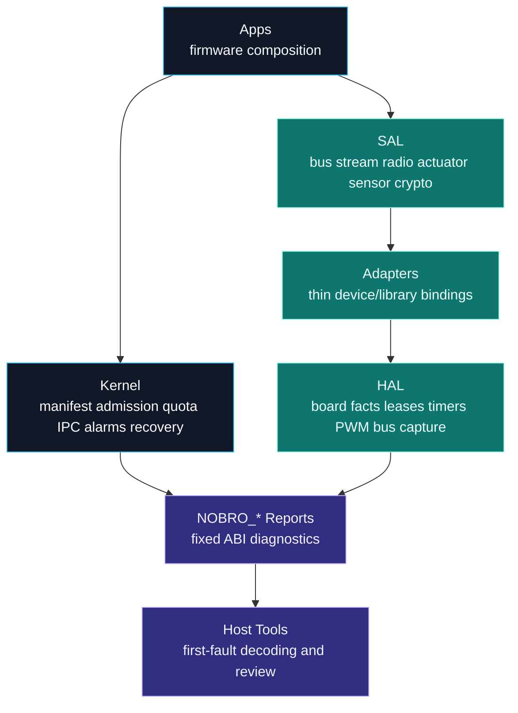
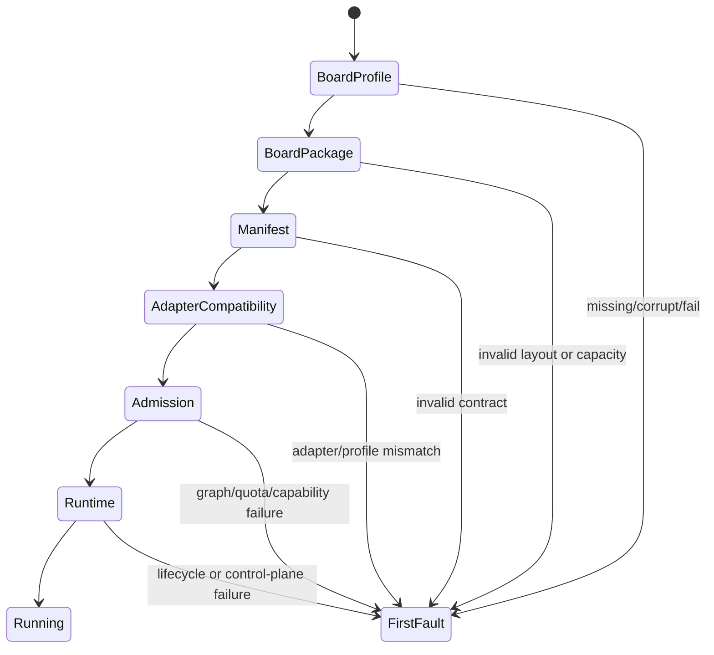
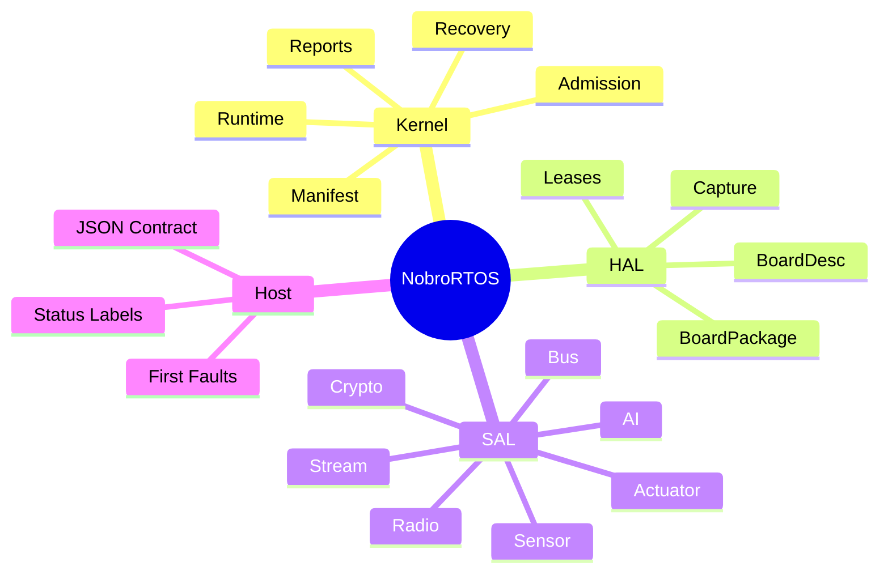

# NobroRTOS

<p align="center">
  <strong>A compact Rust-first RTOS for AI robotics, IoT nodes, deadline-aware control, explicit resource ownership, and host-readable diagnostics.</strong>
</p>

<p align="center">
  <strong>中文名：糙哥RTOS</strong><br>
  糙哥RTOS 是面向 AI 机器人、IoT 与智能控制的超轻量嵌入式实时操作系统。
</p>

<p align="center">
  <a href="https://github.com/dunknowcoding/NobroRTOS"></a>
  
  
  
</p>

<p align="center">
  <code>no_std</code> | <code>static capacity</code> | <code>AI adapters</code> | <code>ROS bridges</code> | <code>NOBRO_* reports</code>
</p>

---

## Signal

NobroRTOS is built for microcontrollers where a servo pulse, an I2C transaction,
a radio slot, and a recovery decision all have to coexist inside tight memory
and timing budgets. It is not a desktop OS in miniature. It is a small,
inspectable control plane for robotics nodes that need to grow from one board
to many boards without turning every driver into a private universe.

The project starts with nRF52840-class boards and a deliberately compact kernel
surface: manifests, quotas, capability grants, static sample pools, health
reports, recovery policy, bounded AI inference contracts, and a service
abstraction layer for hardware, communication, and edge intelligence.

**Repository:** https://github.com/dunknowcoding/NobroRTOS
**Author:** dunknowcoding (YouTube NiusRobotLab)
**License:** Apache-2.0

## System Map



## Why It Exists

Robotics firmware often grows in an uncomfortable direction: a board package
owns the pins, a driver owns timing, an app owns recovery, a host script owns
the truth, and every new board adds another private rule. NobroRTOS pushes
those rules into explicit contracts so the system remains teachable,
debuggable, and portable.

The design target is a friendly RTOS with strong engineering bones:

| Pillar | What NobroRTOS Does |
| --- | --- |
| Deadline discipline | Keeps deadline contracts visible in scheduling and module specs |
| Static memory | Uses fixed-capacity pools, reports, mailboxes, alarms, and ledgers |
| Compatibility | Treats board layout, capacity, pins, and boot profile as data |
| Modularity | Keeps apps, adapters, SAL, kernel, HAL, and host contracts separated |
| Diagnostics | Exports stable `NOBRO_*` symbols for first-fault host decoding |
| Recovery | Routes faults through health counters, event logs, and module-scoped actions |
| Edge AI | Treats local inference, sidecars, cloud APIs, and model metadata as bounded RTOS contracts |
| Robotics bridges | Keeps ROS-style topics, services, actions, and parameters outside hard-realtime hot paths |

## Boot Diagnostics

NobroRTOS boot visibility is designed as a chain. Host tooling should report
the first non-passing stage and stop guessing.



| Report Symbol | Purpose |
| --- | --- |
| `NOBRO_BOARD_PROFILE_REPORT` | Selected board identity, flash origin, budgets, and critical pins |
| `NOBRO_BOARD_PACKAGE_REPORT` | Boot layout, flash/RAM regions, capacity, pins, and package validation |
| `NOBRO_MANIFEST_REPORT` | Module graph, capability, budget, and validation summary |
| `NOBRO_ADAPTER_COMPAT_REPORT` | Adapter inventory and profile compatibility |
| `NOBRO_ADMISSION_REPORT` | Startup ordering, quota seeding, and grant construction result |
| `NOBRO_RUNTIME_REPORT` | Runtime state, mailbox pressure, alarm schedule, quota usage, and event pressure |

## Current Progress

The strongest completed area is the software control plane. Local Rust tests
cover manifests, quota accounting, capability grants, runtime disable paths,
mailbox cleanup, alarm cleanup, watchdog cleanup, degraded-mode reports,
board-package validation, boot assembly, and host-readable diagnostics.



Near-term engineering focus:

- connect app assembly patterns to `BootAssembly` without hiding contracts
- keep board profile and board package fixtures aligned
- harden adapter manifests and compatibility examples
- grow AI inference and ROS/micro-ROS bridge contracts without adding heap
  pressure to realtime paths
- expand host decoding examples for `NOBRO_*` reports
- keep every hardware-facing feature backed by a software validation gate

## Repository Layout

```text
NobroRTOS/
|-- core/
|   |-- crates/
|   |   |-- nobro_kernel/   # manifest, admission, runtime, recovery, reports
|   |   |-- nobro_hal/      # board data, leases, timers, PWM, bus, capture
|   |   |-- nobro_sal/      # portable service traits
|   |   `-- nobro_host/     # host report decoders and stable labels
|   |-- adapters/           # thin SAL implementations
|   |-- apps/               # firmware compositions and evaluation apps
|   `-- boards/             # board-facing notes and layout policy
|-- sdk/                    # standalone SDK packaging surface
|-- packages/               # Arduino and PlatformIO package surfaces
|-- bindings/               # C, C++, and Python-facing wrappers
|-- tools/                  # package builders, validators, generators
|-- docs/                   # user, API, architecture, porting, operations, roadmap
|-- host/                   # JSON mirror of the host contract
`-- LICENSE
```

The Rust crate package names use the `nobro-*` API prefix, while repository
folders use the `nobro_*` project prefix.

## Capability Matrix

| Area | Status | Notes |
| --- | --- | --- |
| Kernel manifest model | Present | Fixed-capacity module specs, criticality, capability bits, budgets |
| Startup planning | Present | Graph planner with cycle and capacity checks |
| Runtime control plane | Present | Mailbox, alarms, KV, quotas, watchdog, health, recovery |
| Boot assembly facade | Present | No-heap app startup helper preserving manifest/admission reports |
| Board package validation | Present | Boot layout, flash/RAM region, capacity, critical pins |
| Board package fixtures | Present | Host-reviewable package list for current boot layouts |
| Host ABI contract | Present | JSON contract plus `nobro-host` layouts and status helpers |
| Adapter compatibility | Present | Descriptor sets, preflight, compatibility report |
| AI adapter contract | Present | Bounded inference request/result contract, route policy, and host-readable model reports |
| AI route policy | Present | Local, edge, remote, and hybrid inference routing with stale snapshot fallback |
| Multi-board expansion | In progress | Board facts are data-first with profile/package fixtures |
| Host tooling UX | In progress | Host, report, boot, and distribution metadata checks are available |
| ROS bridge model | Present | Bounded topic/service/action/parameter contracts, SAL bridge trait, and bridge reports |
| SDK packaging | Scaffolded | Standalone SDK, Arduino, and PlatformIO metadata are contract-checked |
| C/C++/Python interfaces | In progress | C/C++ reports, AI/ROS contracts, plus Python builders, decoders, and validators |

## Quick Start

Install Rust and the embedded target:

```powershell
rustup target add thumbv7em-none-eabihf
```

Run host-side validation from the workspace:

```powershell
cd core
$env:CARGO_TARGET_DIR = (Resolve-Path '..\_work').Path + '\cargo-target'
cargo test -p nobro-kernel --target x86_64-pc-windows-msvc
cargo test -p nobro-sal --target x86_64-pc-windows-msvc
cargo test -p nobro-host --target x86_64-pc-windows-msvc
```

Check the embedded build graph:

```powershell
cd core
$env:CARGO_TARGET_DIR = (Resolve-Path '..\_work').Path + '\cargo-target'
cargo check --workspace
```

Use `_work/` for local build products, downloaded tools, logs, and scratch
artifacts. It is intentionally ignored by Git.

Validate public contracts and package metadata:

```powershell
python tools/nobro_contract_tool.py check-host-contract
python tools/nobro_contract_tool.py check-distribution-metadata
```

## Documentation

| Guide | Use It For |
| --- | --- |
| [User Manual](docs/user-manual.md) | Setup, app assembly, diagnostics, common workflows |
| [API Manual](docs/api-manual.md) | Public crate contracts and examples |
| [System Architecture](docs/system-architecture.md) | Layering, memory discipline, recovery model |
| [Porting Guide](docs/porting-guide.md) | Adding boards and preserving board/package contracts |
| [Host Contract](docs/host-contract.md) | `NOBRO_*` ABI, checksum rules, stage order |
| [Operations Guide](docs/operations-guide.md) | Maintenance habits and validation gates |
| [Roadmap](docs/roadmap.md) | Current progress and next technical milestones |

## Design Influences

NobroRTOS borrows carefully from proven embedded systems ideas:

- hardware description as data, inspired by Zephyr devicetree
- static async direction, inspired by Embassy
- isolation through Rust boundaries, inspired by Tock
- bounded mixed-criticality discipline, inspired by seL4 MCS

The project keeps those ideas small enough for approachable robotics firmware.
