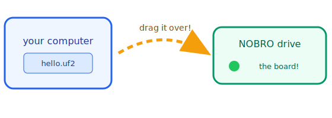
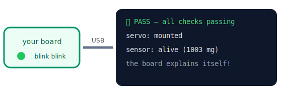

# 01 — First Light 🔆

*For absolute beginners — no code, no installs, big friendly steps.*

You will put a tiny "brain program" onto a robot board, and the board will start
**talking back to you** — telling you it's healthy, in plain sentences.



## What you need

| Thing | What it looks like | Where to get it |
| --- | --- | --- |
| An nRF52840 board with a UF2 bootloader | a small board with a USB plug (nice!nano-style boards work great) | any electronics shop; ask a grown-up to check it says "nRF52840" and "UF2" |
| A USB cable | the same kind many game controllers use | you probably have one! |
| A computer with a web browser | any laptop | — |
| The firmware file `nobro-hello.uf2` | one small file | in this project's `sdk/firmware/` folder, or ask whoever gave you the board |

**No programming tools. No installs. Really.**

## Step 1 — Wake the board's "listening mode"

Plug the board into the computer. Now press the little **RESET button twice,
quickly** — tap-tap, like a double-click. A new drive appears on the computer,
like a USB stick. It's usually called something like `NOBRO` or `NICENANO`.

> Nothing appeared? Try the double-tap a bit faster or a bit slower. The board is
> listening for two taps within about half a second.

## Step 2 — Drag the brain onto the board

Find `nobro-hello.uf2` and **drag it onto that new drive**, like moving a photo
between folders. The drive disappears — that's the board saying "got it!" — and a
light starts blinking.

## Step 3 — Hear the board talk

Open the **report console** in your browser: open
[`packages/web-flasher/index.html`](../../packages/web-flasher/index.html) (double-click
it), press **"Open report console"**, and pick your board from the list.



You'll see lines like:

```
✅ PASS — all checks passing, 13 subsystems
```

That's not a decoration. The board is *actually checking itself* — its memory, its
timers, its rules — and reporting the truth. Grown-up engineers call this
"self-verification". You just did it with a drag and a click.

## ✔ Verify

- [ ] The drive appeared after the double-tap
- [ ] The drive vanished after the drag (that means the flash worked)
- [ ] The console shows a line with **PASS**

## What just happened? (for curious minds)

The `.uf2` file is a whole tiny operating system. The double-tap woke a helper
program (a *bootloader*) whose only job is to copy new brains in. And the sentences
in the console come from the board's *reports* — little scoreboards it fills in
about its own health. Ready to build your OWN app? Climb to
[02 — Build with Blocks](../02-build-with-blocks/README.md) →
