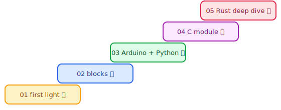

# The NobroRTOS Tutorial Ladder

Five tiers, from a first light with **zero code** to Rust internals. Every tier tells
you exactly what hardware and software you need, where to get it, and how to *verify*
you succeeded — because in NobroRTOS, "it works" is always a report you can read.

| Tier | For | You'll need | You'll end with |
| --- | --- | --- | --- |
| [01 — First Light](01-first-light/README.md) | absolute beginners & kids 🔆 | a board + a USB cable | a blinking board that *tells you* it's healthy |
| [02 — Build with Blocks](02-build-with-blocks/README.md) | no-syntax builders 🧩 | a browser | an app designed as blocks, validated by one command |
| [03 — Arduino & Python](03-arduino-and-python/README.md) | first-language learners 🐍 | Arduino IDE *or* Python | reading real reports with simple, high-level APIs |
| [04 — Your First Module](04-your-first-module/README.md) | C/C++ developers 🔧 | arm-none-eabi-gcc | your C code running under the kernel, no Rust installed |
| [05 — Rust Deep Dive](05-rust-deep-dive/README.md) | pros 🦀 | the Rust toolchain | backend-swapped drivers, static budgets, and portable checks |

Climb in order or jump to your level — each tier stands alone and each ends with a
**Verify** step. Reference docs live in [`docs/`](../docs/README.md); the
[`hello-device/`](hello-device/) folder holds the shared example app used by tier 02.

`python tools/tutorial_runner.py` validates this ladder in CI.
